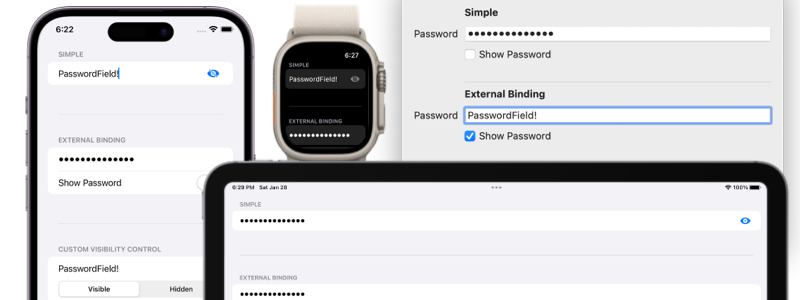

# PasswordField

PasswordField is a SwiftUI view that allows users to toggle the visibility of the input in a secure field.



## Installation
PasswordField is available through [Swift Package Manager](https://swift.org/package-manager).

```swift
.package(url: "https://github.com/MrAsterisco/PasswordField", from: "<see GitHub releases>")
```

### Latest Release
To find out the latest version, look at the Releases tab of this repository.

## Usage
PasswordField works like a `SecureField`: you pass a `Binding<String>` while creating an instance. By default, it will automatically apply the correct style for the target platform.

```swift
@State private var password = ""

// Default title: "Password"
PasswordField(text: $password)

// Custom title
PasswordField("Your Password", text: $password)
```

### Custom Visibility Control
You can customize the control the user uses to toggle the visibility of the input by passing a `@ViewBuilder` closure to the initializer. The closure will receive as only parameter a `Binding<Bool>` which you should use with your custom view.

```swift
@State private var password = ""

PasswordField(text: $password) { isInputVisible in
  Picker("", selection: isInputVisible) {
    Text("Visible")
      .tag(true)
    
    Text("Hidden")
      .tag(false)
  }
}
```
### Modifiers
You can pass your own binding that will be used to control the input visibility:

```swift
@State private var password = ""
@State private var isInputVisible = false

PasswordField(text: $password)
  .inputVisibile($isInputVisible)
```

You can also customize the position of the input visibility control or hide it completely:

```swift
@State private var password = ""

PasswordField(text: $password)
  .visibilityControlPosition(.hidden) // or: .inlineInside, .inlineOutside, below
```

You can also customize the text content type, for example to specify to the system that this is a new password:

```swift
@State private var password = ""

PasswordField(text: $password)
  // Possible values are defined in `UITextContentType`,
  // `WKTextContentType` or `NSTextContentType`, depending
  // on the target platform.
  .textContentType(.newPassword)
```

## Platform Behaviors
On iOS and watchOS, the PasswordField will appear as a normal `SecureField` with a button to toggle the visibility of the input. 

On macOS, a checkbox will be displayed below the field with the same purpose of the button.

tvOS works differently with text input and, most of the times, users will most probably type with another device: for these reasons, **PasswordField is marked as unavailable on tvOS**.

## Compatibility
PasswordField requires **iOS 15.0 or later**, **macOS 12.0 or later**, and **watchOS 8.0** or later. It is **not** available on tvOS, although it can be referenced on multi-platform projects targeting **tvOS 13.0 or later**.

## Contributions
All contributions to expand the library are welcome. Fork the repo, make the changes you want, and open a Pull Request.

If you make changes to the codebase, I am not enforcing a coding style, but I may ask you to make changes based on how the rest of the library is made.

## Status
This library is under **active development**. Even if most of the APIs are pretty straightforward, **they may change in the future**; but you don't have to worry about that, because releases will follow [Semantic Versioning 2.0.0](https://semver.org/).

## License
ComboPicker is distributed under the MIT license. [See LICENSE](https://github.com/MrAsterisco/PasswordField/blob/master/LICENSE) for details.
